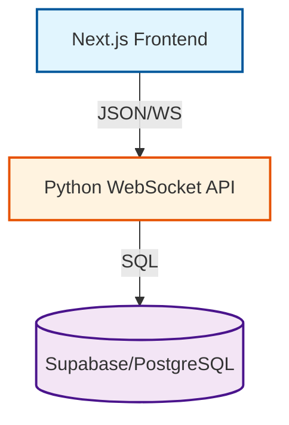

# Universal AI-Driven Project Structure

Use this structure for every new project to ensure **Cursor, Claude, Gemini CLI, Antigravity, and Codex** all stay in sync and never ask you to repeat yourself.

## 1. Directory Structure
Create these folders/files in your project root:

```text
/my-awesome-project
├── .antigravity/
│   └── memory/             # Persistent snapshots of AI-human chats
├── .cursor/rules/
│   └── project_rules.mdc   # Custom coding standards for Cursor
├── .gemini/
│   └── settings.json       # Hook configs for Gemini CLI
├── graphify-out/
│   ├── graph.json          # The universal knowledge graph database
│   └── GRAPH_REPORT.md     # The human-readable summary of the graph
├── ai_brain/
│   ├── current_task.md     # Detailed state of the ACTIVE task
│   ├── features_log.md     # History of every feature added (AI-maintained)
│   ├── architecture.md     # Mermaid diagrams of the system
│   └── constraints.md      # "DO NOT" rules (e.g. "Don't use library X")
└── AI_CONTEXT.md           # The Master Entry Point
```

## 2. The "AI Handshake" Rule
Add this instruction to your global AI settings (or `AI_CONTEXT.md`):

> "Before starting any task, read `ai_brain/`. After finishing a task, you MUST update `ai_brain/features_log.md` with what you changed and update `ai_brain/current_task.md` with the next logical step. Do not ask for permission to update these files."

## 3. Tool-Specific Configs
| Tool | File to Create | Purpose |
| :--- | :--- | :--- |
| **Claude Code** | `CLAUDE.md` | Tells Claude to check `graphify-out/` before answering. |
| **Codex / Aider** | `AGENTS.md` | Provides the "Source of Truth" for terminal-based agents. |
| **Cursor** | `.cursor/rules/*.mdc` | Custom rules to ensure Cursor follows your project patterns. |
| **Antigravity** | `.antigravity/memory/` | Stores snapshots of our high-level planning. |

## 4. Graphify: The Universal Bridge
To make the "Load Balancing" work, run these commands in every new project:

### Step A: Installation (One-time)
```bash
pip install graphifyy
```

### Step B: The "Universal Link"
Run these to tell every agent where the graph is:
```bash
python -m graphify antigravity install
python -m graphify gemini install
python -m graphify codex install
python -m graphify cursor install
python -m graphify claude install
```

### Step C: Indexing
Build the graph for the first time:
```bash
python -m graphify update .
```

## 5. How Agents Use It
- **When switching from Claude to Cursor**: Claude updates `ai_brain/features_log.md`. Cursor reads it and knows exactly what Claude just built.
- **When the project gets too big**: Graphify "balances" the context. Instead of reading 100 files, the AI reads the 1-page `graphify-out/GRAPH_REPORT.md` and only the relevant code snippets.

---

## 6. The "Handoff" Protocol (Switching AIs)
When you move from one AI (e.g. Claude) to another (e.g. Cursor), follow these steps:

1.  **Closing AI**: Before closing, tell the current AI: *"Summarize what you just finished in `ai_brain/features_log.md` and update `ai_brain/current_task.md` with exactly where you left off."*
2.  **The Handshake**: The AI should write a "Next Steps" section.
3.  **Opening AI**: When you open the new AI, your first prompt should be: *"Read `AI_CONTEXT.md` and `ai_brain/current_task.md` to sync your state."*

## 7. The "State Recovery" Prompt
If an AI starts making mistakes, hallucinating, or ignoring your tech stack, paste this **State Recovery Command**:

> **STOP. You are losing context.** 
> 1. Re-read `ai_brain/constraints.md` for the "DO NOT" rules.
> 2. Run `/graphify query "What is the current architecture and state of the project?"`
> 3. Summarize the current problem and explain why your last 3 responses were incorrect based on the knowledge graph.
> 4. Do not proceed until you have confirmed the correct state.

## 8. Visual Templates (Mermaid Graph Styles)
To ensure all AIs draw diagrams that look the same, force them to use this **Standard Mermaid Template** in `ai_brain/architecture.md`:



## 9. Context Load Balancing (The Graphify Secret)
When the project gets massive:
- **Don't** feed the AI the whole code.
- **Do** tell the AI: *"Use the knowledge graph to find the relevant 3 files for this bug, and ignore everything else."*
- This keeps your token usage low and the AI's "IQ" high.

---

## 10. Advanced AI Operations
To prevent bugs and architectural drift, use these advanced commands:

### A. The "Self-Audit" Step
Before saying "Task Complete," the AI must perform a self-audit:
- *"Verify your changes against `ai_brain/constraints.md` and `ai_brain/architecture.md`. State clearly if you deviated from the planned design and why."*

### B. The "Cross-Agent PR Review"
Use a "Fresh" AI to review work from another AI:
1.  Finish a feature in Cursor.
2.  Open Claude/Antigravity and say: *"I've finished the feature in `ai_brain/current_task.md`. Review the code for anti-patterns and ensure it doesn't break our WebSocket logic in `architecture.md`."*

### C. Semantic Architecture Queries
If the AI is confused about how two parts of the system interact:
- *"Run `graphify path 'nextjs-client' 'python-backend'` to see the exact chain of dependencies between these two modules."*

## 11. The "Security & Secrets" Protocol
AIs are prone to accidentally committing secrets. Force this rule:
- **Rule**: *"Never generate code that includes hardcoded API keys, passwords, or secrets. Always use environment variables and check for a `.env.example` file for the required keys."*
- **Action**: *"If you see a secret in plain text, immediately notify the user and move it to a `.env` file (and add it to `.gitignore`)."*

---

## 12. The Master Copyable Prompts (Quick Copy)
Copy and paste these directly into your AI assistant whenever you need to sync or fix context.

### 🟢 The "Daily Driver" Prompt (Start & End Session)
> **CONTEXT SYNC & LOGGING RULE**:
> **PROJECT MASTER INSTRUCTION (SYNC & EXECUTE)**:
> 
> **1. IDENTITY & CONTEXT**: You are a member of a multi-agent team (Antigravity, Claude, Cursor, Gemini). 
> - Read `AI_CONTEXT.md`, `ai_brain/current_task.md`, and `ai_brain/constraints.md` IMMEDIATELY.
> - **Tech Stack**: Auto-detect from project files (e.g. `package.json`, `pubspec.yaml`, `requirements.txt`) and `AI_CONTEXT.md`.
> 
> **2. KNOWLEDGE GRAPH NAVIGATION**: Use Graphify for load-balancing context.
> - If the project is large, read `graphify-out/GRAPH_REPORT.md` first.
> - Run `/graphify query` for any architectural questions. Never guess file paths.
> 
> **3. DEVELOPMENT PROTOCOL**:
> - **Self-Audit**: Before submission, verify code against `ai_brain/constraints.md` and `ai_brain/architecture.md`.
> - **Security**: Never hardcode secrets. Use `.env` and `.env.example`.
> - **Visuals**: Maintain Mermaid diagrams in `ai_brain/architecture.md` using the Standard Template.
> 
> **4. COMPLETION & HANDOFF**:
> - Update `ai_brain/features_log.md` with a summary of every added feature.
> - Update `ai_brain/current_task.md` with "NEXT_STEPS" and any pending variable/state info.
> - Prepare the state so the next AI (e.g. Cursor or Claude) can pick up without re-explaining.
> 
> **Do not ask for permission to update these files. Proceed with the current task in `ai_brain/current_task.md`.**

### 🔴 The "Emergency Bug/Hallucination" Prompt
> **STOP. YOU ARE HALLUCINATING OR LOSING CONTEXT.**
> 1. RE-READ `ai_brain/constraints.md` for the "DO NOT" rules.
> 2. RUN `/graphify query "What is the current architecture and state of the project?"`
> 3. ANALYZE why your last responses were incorrect based on the knowledge graph.
> 4. VERIFY: Never hardcode secrets/keys. Use environment variables.
> 5. EXPLAIN the fix before writing any more code. Do not proceed until I confirm.

### 🔄 Parallel Agent Coordination (Multiple AIs Working Together)
If you have multiple AI tools (e.g. Antigravity and Cursor) open at the same time, use this prompt to keep them from fighting:

> **TEAM COORDINATION RULE**:
> Before you touch any file, check `ai_brain/current_task.md`. 
> 1. If another AI is already working on a file, DO NOT touch it.
> 2. When you finish a sub-task, update `ai_brain/features_log.md` IMMEDIATELY.
> 3. If you change a shared variable or API endpoint, broadcast the change by updating `ai_brain/architecture.md`.
> 4. Periodically run `graphify update .` to see what the other AIs have contributed to the knowledge graph.

### 🔵 The "Security Auditor" Prompt (Hardening & Anti-Hack)
> **SECURITY AUDIT MODE**:
> 1. Analyze the codebase for vulnerabilities: SQL injection, XSS, insecure WebSocket handshakes, and logic flaws.
> 2. Search for any patterns that could be exploited via reverse-engineering or "Hacking/Attack" vectors.
> 3. Suggest immediate code hardening fixes and auto-implement them if I approve.
> 4. Verify that no sensitive data is being logged or transmitted in plain text.

### 🟡 The "Visionary & Bug Hunter" Prompt (Innovation)
> **DEEP SCAN & INNOVATION MODE**:
> 1. Perform a "Deep Scan" for hidden bugs: Race conditions, memory leaks, or UI state desyncs.
> 2. Suggest 3 "Future Features" that would take this project to the next level based on the current architecture.
> 3. Identify any "Technical Debt" that will slow us down later and propose a refactor plan.
> 4. Update `ai_brain/architecture.md` with any discovered patterns.

---
*End of Master Operating Manual. Your project is now 100% AI-Synchronized.*


